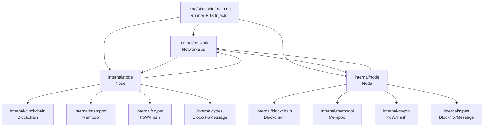
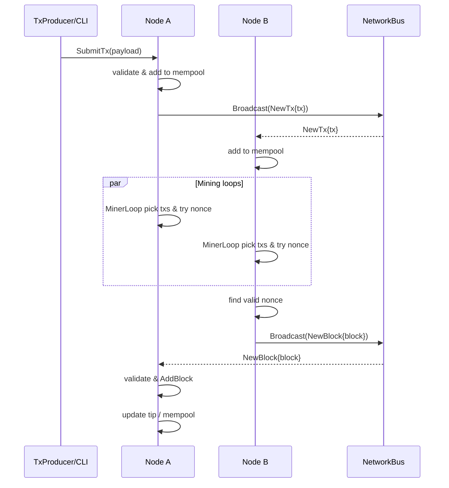
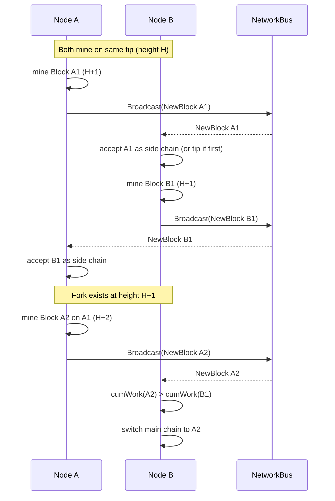
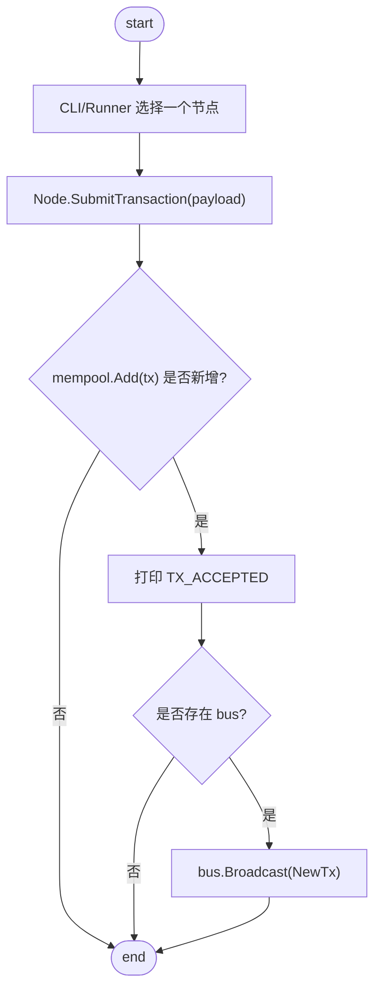
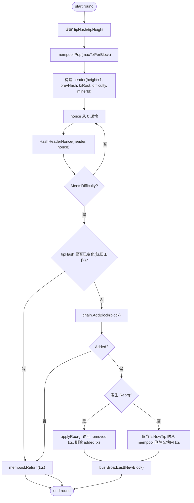
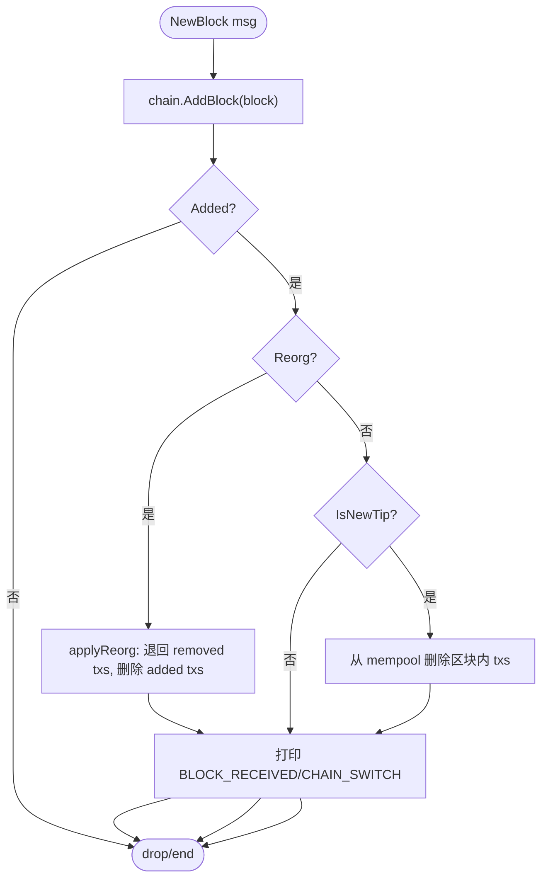

# simchain-go 设计文档（增强版）

本项目是一个**单机多节点**的极简区块链模拟器，目标是帮助你用 Go 亲手理解：区块结构、PoW 挖矿、节点同步、分叉与主链选择。  
它不是生产级链，也不追求与任何现有公链兼容。

## 1. 目标与非目标

**目标**
- 独立 Go 项目，零外部依赖（优先只用标准库）。
- 在同一进程内启动 N 个节点，模拟“交易产生 -> 打包 -> 挖矿出块 -> 广播 -> 收敛到主链”。
- PoW 共识：基于 `sha256` 哈希和可配置难度。
- 支持基本分叉处理：最长链 / 最大累积难度链。
- 输出清晰日志与统计，便于观察挖矿/同步行为。

**非目标**
- 不实现真实 P2P 网络、真实钱包、签名、UTXO、智能合约等复杂系统。
- 不考虑经济模型安全性（如自私挖矿、51% 攻击等），仅做演示。
- 不做性能/吞吐优化。

## 2. 总体架构

```
┌──────────────┐      broadcast        ┌──────────────┐
│   Node A     │ <-------------------> │   Node B     │   ... Node N
│              │   via NetworkBus      │              │
│  Mempool     │                       │  Mempool     │
│  Miner Loop  │                       │  Miner Loop  │
│  Blockchain  │                       │  Blockchain  │
└──────┬───────┘                       └──────┬───────┘
       │                                        │
       └──────────── NetworkBus (in-memory) ────┘
```

- `NetworkBus`：内存发布/订阅总线，负责转发消息、模拟延迟/丢包/分区（可选）。
- `Node`：节点，维护 mempool 与本地区块链，运行挖矿 goroutine。
- `Blockchain`：区块索引与主链选择，处理分叉。

### 2.1 代码/模块架构图（当前项目实现）

下面这张图描述的是**当前仓库代码结构**与数据流（包名对应 `internal/...`）。



## 3. 术语与约定

- **区块哈希**：对 `BlockHeader + Nonce` 的 `sha256` 结果（32 字节）。
- **难度**：用“前导零 bit 数”表达。  
  例如 difficulty=16 表示哈希二进制前 16 位为 0。
- **工作量（Work）**：单个区块的工作量可近似为 `2^difficulty`；累积工作量为主链上所有区块工作量之和。
- **主链**：累积工作量最大的链；难度恒定时等价于最长链。

## 4. 数据模型

### 4.1 Transaction（极简）
仅用于演示，无签名/余额校验。

字段建议：
- `ID string`：交易唯一 ID（可用时间戳+随机）。
- `Timestamp int64`
- `Payload string`：任意字符串。

序列化：JSON；区块内存储按 insertion order。

### 4.2 BlockHeader / Block

```
BlockHeader {
  Height        uint64
  PrevHash      [32]byte
  Timestamp     int64
  Difficulty    uint32    // leading zero bits
  MinerID       string
  TxRoot        [32]byte  // 简化的交易摘要
}

Block {
  Header BlockHeader
  Nonce  uint64
  Hash   [32]byte
  Txs    []Transaction
}
```

`TxRoot` 计算策略：
- 轻量实现：把所有 `Tx.ID` 用 `\n` 拼接后哈希。
- 不做完整 Merkle Tree，但接口留在这里，方便以后替换。

### 4.3 ChainIndex

内部索引结构：
- `blocks map[Hash]*Block`
- `parent map[Hash]Hash`
- `cumWork map[Hash]*big.Int`
- `tip Hash`：当前主链头

## 5. 共识与挖矿

### 5.1 PoW 规则
定义：

```
hash = SHA256( Serialize(header) || nonce )
valid if LeadingZeroBits(hash) >= header.Difficulty
```

难度恒定由 CLI 参数提供，所有节点一致。

### 5.2 挖矿循环（节点内 goroutine）

伪代码：

```
loop:
  txs = mempool.pop(maxTxPerBlock)
  header = buildHeader(txs, tipHash, height+1, difficulty, minerID)
  for nonce = 0..:
    h = hash(header, nonce)
    if meetsDifficulty(h):
      block = {header, nonce, h, txs}
      blockchain.add(block)
      bus.broadcast(NewBlock(block))
      break
  sleep(minerSleep) // 避免占满 CPU，且便于观察
```

### 5.3 出块奖励
为了完整性，可以在日志中统计“谁挖到多少块”；不实现真实余额系统。

## 6. 节点行为与状态机

### 6.1 节点持有状态
- `id string`
- `chain *Blockchain`
- `mempool *Mempool`
- `bus *NetworkBus`
- `mining bool`
- `stats MinerStats`

### 6.2 消息处理
节点订阅总线消息，按类型处理：

**消息类型**
- `NewTx`：收到交易，去重后加入 mempool，并广播给其他节点。
- `NewBlock`：收到新区块，先校验，再尝试加入链。若主链切换，需要回滚/重放 mempool（简化：把非主链块的交易放回 mempool）。
- `RequestTip` / `ResponseTip`（可选）：节点初始启动时同步链头信息。

### 6.2.1 消息协议字段

虽然当前 `NetworkBus` 处于同一进程内、直接传递 Go 结构体，但为了方便将来替换为真实网络，这里先定义一个“线上的”逻辑协议（JSON 形态）。实现时可用对应的 Go struct 1:1 映射。

**通用消息封装**

```
Message {
  type: string,        // 消息类型
  from: string,        // 发送节点 ID
  to?: string,         // 可选，未来做点对点回复用
  timestamp: int64,    // unix ms
  traceId?: string,    // 可选，便于日志串联
  payload: object      // 类型相关字段
}
```

**类型与 payload 字段**

| type | payload 字段 | 说明 |
| --- | --- | --- |
| `NewTx` | `tx: Transaction` | 广播新交易。Transaction 与 4.1 定义一致。 |
| `NewBlock` | `block: Block` | 广播完整新区块。Block 与 4.2 定义一致。 |
| `RequestTip` | `knownTipHash?: string` `knownHeight?: uint64` | 新节点启动或发现落后时请求链头；可附带已知 tip 信息（hash 为 hex）。 |
| `ResponseTip` | `tipHash: string` `tipHeight: uint64` `cumWork: string` `blocks?: []Block` | 回复链头信息；必要时可携带从已知 tip 之后的区块列表（cumWork 为十进制字符串）。 |

说明：
- `hash` 在协议中统一用 64 位 hex 字符串表示（对应 32 字节）。  
- `blocks` 是可选字段，初版实现可只回 tip 元数据；后续做真实网络时再用它做链同步。  

### 6.3 链选择与分叉

加入新区块时：
1. 校验 `PrevHash` 是否存在（不存在则缓存为 orphan，等待父块）。
2. 校验 PoW、时间戳、TxRoot。
3. 计算 `cumWork[block] = cumWork[parent] + Work(block)`。
4. 如果 `cumWork[block] > cumWork[tip]`，执行**主链切换**：
   - 从新 tip 回溯到共同祖先；
   - 旧主链上被移除的块交易全部退回 mempool；
   - 新主链上的块交易从 mempool 删除（若存在）。

难度恒定时可退化为“高度更高则切换”。

### 6.4 关键流程时序图

以下用 mermaid 时序图描述关键交互流程（实现时等价于 in-memory bus 的调用顺序）。

**正常出块流程（交易 -> 挖矿 -> 广播 -> 收敛）**



**同高分叉与主链切换**



### 6.5 关键流程图（Flowchart）

**交易提交流程（SubmitTx）**



**挖矿流程（MinerLoop 单轮）**



**接收新区块流程（Handle NewBlock）**



## 7. NetworkBus（内存网络）

职责：
- 管理节点订阅列表。
- 广播消息到所有其他节点。
- 可选注入故障（后续扩展）：固定/随机延迟、丢包率、网络分区。

接口建议：
- `Register(nodeID string, handler func(Message))`
- `Broadcast(from string, msg Message)`
- `SetDelay(d time.Duration)` / `SetDropRate(p float64)`

## 8. CLI 与可配置项

命令：`go run ./cmd/simchain`

建议 flags：
- `--nodes`：节点数（默认 2）
- `--difficulty`：前导零 bit 数（默认 16）
- `--duration`：运行时间（默认 30s）
- `--max-tx-per-block`：每块最大交易数（默认 50）
- `--tx-interval`：注入交易间隔（默认 1s）
- `--miner-sleep`：挖矿循环 sleep（默认 10ms）
- `--seed`：随机种子，保证可复现（可选）
- `--log-level`：info/debug（可选）

## 9. 日志与观测

日志目标：让你能肉眼追踪链是否收敛、谁在挖、是否发生分叉。

建议事件：
- `TX_ACCEPTED node=X tx=Y`
- `BLOCK_MINED node=X h=H hash=abcd... nonce=N txs=K`
- `BLOCK_RECEIVED node=X from=Y h=H hash=abcd...`
- `CHAIN_SWITCH node=X oldTip=... newTip=... forkDepth=D`
- `STATS node=X mined=M height=H mempool=K`

## 10. 测试策略

**单元测试**
- `crypto`: `LeadingZeroBits` 与 `MeetsDifficulty` 的边界条件。
- `blockchain`:  
  - 顺序添加块能增长高度；  
  - 乱序/分叉添加后主链选择正确；  
  - 主链切换后 mempool 回收正确。

**集成验证**
- 运行 `cmd/simchain` 30s，最终所有节点 `tipHash` 一致。

## 11. 实现里程碑（不涉及代码细节）
1. 搭好 types + crypto + basic PoW 校验。
2. 实现 Blockchain 索引与主链选择。
3. 实现 Node + Mempool + MinerLoop。
4. 实现 NetworkBus + CLI runner。
5. 补测试与文档示例。

## 12. 未来扩展方向
- 把 NetworkBus 替换为真实 TCP/HTTP/WS，使节点可多进程/多机运行。
- 增加 Merkle Tree 与交易签名，向真实链靠拢。
- 引入动态难度与目标出块间隔。

## 13. 如何确认全流程正确（当前版本的验收清单）

这份清单的目标是：你能用命令行在本地确认“交易传播、出块、同步、分叉、收敛”都符合设计。

### 13.1 构建与单元测试

```powershell
go test ./...
```

期望：
- `internal/crypto` 的难度/前导零逻辑测试通过。
- `internal/blockchain` 的分叉与主链选择测试通过。

### 13.2 端到端跑通（2 节点、稳定收敛）

```powershell
go run ./cmd/simchain --nodes=2 --difficulty=16 --duration=10s --tx-interval=500ms --seed=1
```

期望（看日志/最终统计即可）：  
- 两个节点都有 `MINER_START`、持续 `BLOCK_MINED`/`BLOCK_RECEIVED` 日志。  
- 结束时输出 `STATS ... height=...`，**所有节点 height 一致**（表示最终收敛到同一高度）。  

说明：
- 当前 runner 最终只打印 height；如果你想严谨到“tipHash 也一致”，可以在 `cmd/simchain/main.go` 里额外打印 `chain.TipHash()`（后续我们可加一个 `--print-tip` 开关）。  

### 13.3 分叉/重组验证（观察 CHAIN_SWITCH）

目标：人为制造更容易出现的分叉，观察节点发生主链切换后仍然收敛。

建议做法（无需改协议，只是调整模拟网络环境）：
- 在 `cmd/simchain/main.go` 创建 bus 后调用（任选其一或组合）：
  - `bus.SetDelay(30 * time.Millisecond)`：增加传播延迟，让多个节点更可能在同一高度同时挖到块。
  - `bus.SetDropRate(0.1)`：模拟小概率丢包，增加分叉/临时不一致的概率。

期望：
- 过程中出现 `CHAIN_SWITCH`（代表节点 tip 发生变更，包含分叉切换场景）。
- 结束时 **所有节点 height 一致**，证明最终收敛。

### 13.4 交易进块验证（可观察）

当前版本把交易当作纯 payload，不做余额/签名验证。你可以用以下方式确认交易至少会传播并被节点去重接收：
- 观察 `TX_ACCEPTED node=X tx=...`，以及另一节点收到 `(... from=Y)` 的日志。

如果你希望进一步确认“交易确实进入区块”，下一步建议：
- 在 `BLOCK_MINED ... txs=K` 的 `K` 不为 0 时，打印该块包含的 txID 列表（这属于日志增强，我们可以在不改共识的情况下加上）。  
